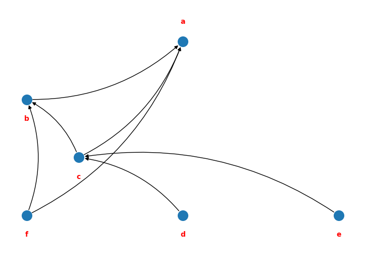
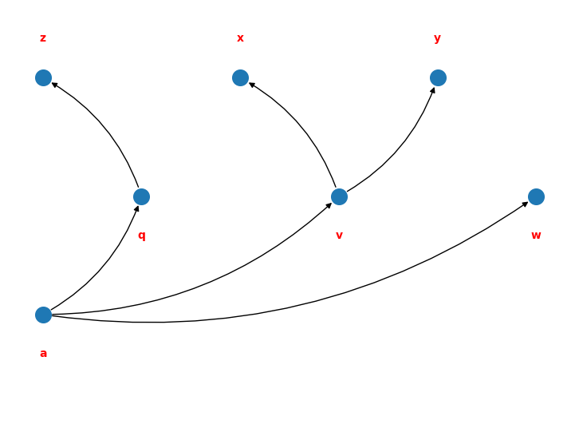

# Call graph
February 2021

Represent the relationships between functions in a module.

For a function given `a`, what has `a` as a dependency? What are `a`'s dependencies? If we alter a function, what should we test? And if we alter a function call signature, where else does this change need to be reflected?

This program creates a call-graph in which a function is represented as either the root (calling function) or leaf (called function) node.

Leaf node call-graph:  
  
Root node call-graph:  
  

It also summarises statistics on the size of the call-graphs in both cases, and represents them textually.

~~~
`Size root graph`: size of the graph where `function` is the root
`Size leaf graph`: size of the graph where `function` is the leaf

Scale factor: 3 (each dot represents 3 calls)
Sorted by size of the root graph

SIZE ROOT GRAPH                     FUNCTION    SIZE TREE GRAPH

..........................          ax          
..........................          ht          
        ..................          bo          
         .................          hu          
            ..............          ay          ..
             .............          bs          .
             .............          eu          ..
             .............          jh          
               ...........          fm          
                ..........          ff          
                 .........          ag          ...
                 .........          ah          ...
                 .........          fg          .
                 .........          fs          
                  ........          am          ...........
                  ........          bl          .
                  ........          dj          
                  ........          et          .
                   .......          ao          ..
                   .......          ap          ............
                   .......          di          
                   .......          ef          
                   .......          er          ..
                   .......          es          ..
                   .......          fr          
                    ......          at          ...
                    ......          au          .
                    ......          av          ..
                    ......          aw          ...
                    ......          du          
                    ......          ew          ..

Sorted by size of the leaf graph:

SIZE ROOT GRAPH                     FUNCTION    SIZE TREE GRAPH

                                    fn          .......................
                         .          ai          ......................
                                    co          ....................
                                    gh          ....................
                                    fl          .................
                                    jg          .................
                                    fk          ................
                                    gl          ................
                        ..          ha          ................
                         .          af          ...............
                         .          bw          ...............
                        ..          ci          ...............
                         .          fp          ...............
                         .          fu          ...............
                         .          gd          ...............
                                    ge          ...............
                                    ck          ..............
                       ...          cl          ..............
                                    gj          ..............
                                    ho          ..............
                                    if          ..............
                                    ij          ..............
                         .          an          .............
                         .          bd          .............
                                    hp          .............
                                    hz          .............
                                    iw          .............
                                    iz          .............
                                    ad          ............
                   .......          ap          ............
~~~

